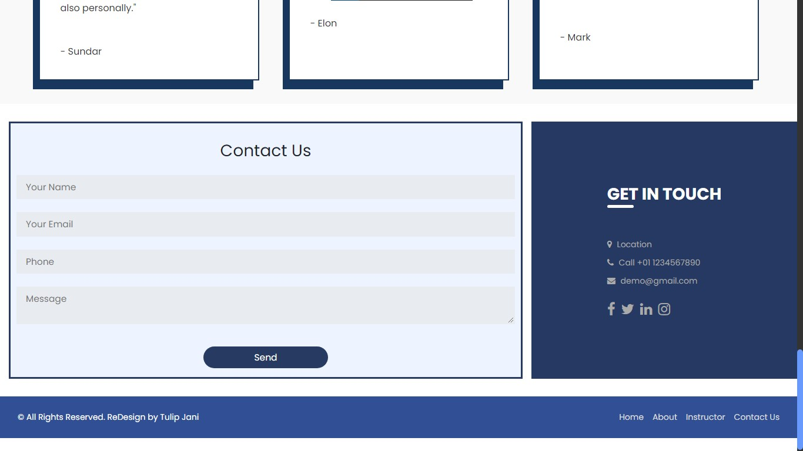

<h1 align="center" id="title">Shri Suyash Academy (Internship Submisson)</h1>

My first ever website created as a submission for my first internship. It is very simple and baisc website for tuition classes named "Shri Suyash Academy". This website is a made using bootstrap framework. and it has 1 only static webpage. It has vector images in it has the modern and clean design.

<h2>Screenshot</h2>

 

  
<h2>💻 Built with</h2>

Technologies used in the project:

*   HTML
*   CSS (Bootstrap)
*   JavaScript
